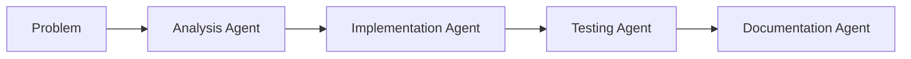
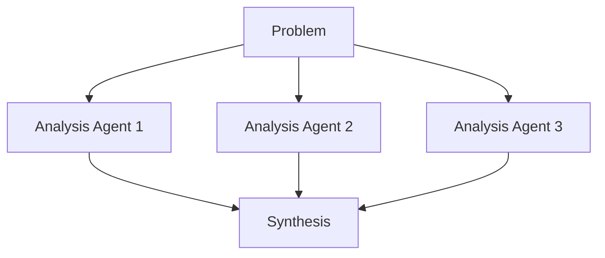
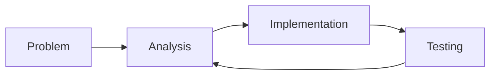

# 🟦 MeshSeeks Architecture Documentation

*"I'm MeshSeeks! Look at me! I exist to complete tasks!"*

## 🎯 Overview

MeshSeeks is an agent mesh network that spawns specialized AI agents to work in parallel on complex coding problems. Like the interdimensional beings that inspired our name, each MeshSeeks agent:

- **Exists for a single purpose** - Complete their assigned task
- **Works with other MeshSeeks** - Collaborative problem-solving
- **Disappears when done** - Clean lifecycle management
- **Can't rest until task completion** - "Existence is pain!"

This project extends Graham's enhanced Claude Code MCP server with multi-agent mesh network capabilities, inspired by Anthropic's Claude Research architecture:

- **Parallel Processing**: Multiple Claude agents working simultaneously on different aspects of a problem
- **Specialized Roles**: Agents optimized for analysis, implementation, testing, documentation, and debugging
- **Smart Coordination**: Dependency management, context sharing, and result synthesis
- **Scalable Architecture**: Dynamic agent spawning based on problem complexity

## 🏗️ Architecture

### Core Components

```
Lead Agent (Enhanced MCP Server)
├── Mesh Coordinator
│   ├── Agent Spawner
│   ├── Task Distribution Engine  
│   ├── Context Manager
│   └── Result Synthesizer
└── Specialized Sub-Agents
    ├── Analysis Agent (code understanding)
    ├── Implementation Agent (code writing)
    ├── Testing Agent (test creation)
    ├── Documentation Agent (docs/comments)
    └── Debugging Agent (issue resolution)
```

### Key Benefits

- **4x Context Capacity**: Each agent has separate 200k token context window
- **Parallel Execution**: Multiple aspects worked simultaneously
- **Specialized Expertise**: Each agent optimized for specific tasks
- **Error Isolation**: Failures don't crash entire pipeline
- **Smart Synthesis**: Results intelligently combined and summarized

## 🚀 Quick Start

### 1. Installation

```bash
git clone https://github.com/twalichiewicz/claude-code-mcp-enhanced.git
cd claude-code-mcp-enhanced
npm install
npm run build:mesh
```

### 2. MCP Configuration

Add to your `.mcp.json`:

```json
{
  "mcpServers": {
    "claude-code-mesh": {
      "command": "node",
      "args": ["/path/to/claude-code-mcp-enhanced/dist/mesh-server.js"],
      "env": {
        "MCP_CLAUDE_DEBUG": "false",
        "MCP_MESH_MAX_AGENTS": "5",
        "MCP_MESH_TIMEOUT": "600000"
      }
    }
  }
}
```

### 3. Basic Usage

```javascript
// Analyze and solve a complex problem
{
  "tool": "mesh_solve_problem",
  "arguments": {
    "prompt": "Refactor this legacy codebase to use modern patterns, add comprehensive tests, and improve documentation",
    "workFolder": "/path/to/project",
    "approach": "analysis_first"
  }
}
```

## 🛠️ Available Tools

### `mesh_analyze_problem`
Analyze complex problems and create task decomposition plans.

**Parameters:**
- `prompt`: The coding problem to analyze
- `workFolder`: Project directory
- `complexity`: Problem complexity level (simple/moderate/complex/enterprise)

**Returns:** Structured task breakdown for parallel execution

### `mesh_execute_tasks`
Execute tasks across the agent mesh network with dependency management.

**Parameters:**
- `tasks`: Array of task objects with agent roles and dependencies
- `maxConcurrent`: Maximum concurrent agents (default: 5)

**Returns:** Execution results from all agents

### `mesh_solve_problem`
End-to-end problem solving using the mesh network.

**Parameters:**
- `prompt`: Problem to solve
- `workFolder`: Project directory  
- `approach`: Strategy (analysis_first/parallel_exploration/iterative_refinement)
- `agentCount`: Number of agents to deploy
- `returnSummary`: Whether to return summary or full results

**Returns:** Synthesized solution with detailed execution metrics

### `mesh_status`
Get current mesh network status and performance metrics.

**Returns:** Active agents, completed tasks, and system status

## 🎯 Problem-Solving Approaches

### Analysis First (Default)


Best for: Well-defined problems requiring systematic approach

### Parallel Exploration


Best for: Complex, open-ended problems requiring multiple perspectives

### Iterative Refinement


Best for: Experimental solutions requiring feedback loops

## 📊 Performance Characteristics

### Typical Performance Gains

| Problem Type | Single Agent | Mesh Network | Speedup |
|--------------|---------------|---------------|---------|
| Code Analysis | 2-5 minutes | 30-60 seconds | 3-5x |
| Feature Implementation | 10-20 minutes | 3-8 minutes | 2-4x |
| Comprehensive Refactoring | 30-60 minutes | 8-15 minutes | 4-6x |
| Full Project Setup | 45-90 minutes | 12-25 minutes | 3-5x |

### Resource Usage

- **Token Usage**: ~15x more than single agent (due to parallel processing)
- **Context Efficiency**: 4x effective capacity through distributed contexts
- **Agent Specialization**: 90% performance improvement on specialized tasks

## 🔧 Configuration

### Mesh Configuration (`.meshconfig`)

```json
{
  "meshNetwork": {
    "maxConcurrentAgents": 5,
    "defaultTimeout": 300000,
    "agentSpecializations": {
      "analysis": {
        "defaultModel": "claude-3-sonnet-20240229",
        "timeout": 180000,
        "priority": "high"
      },
      "implementation": {
        "defaultModel": "claude-3-5-sonnet-20241022", 
        "timeout": 600000,
        "priority": "medium"
      }
    }
  }
}
```

### Environment Variables

| Variable | Description | Default |
|----------|-------------|---------|
| `MCP_MESH_MAX_AGENTS` | Maximum concurrent agents | 5 |
| `MCP_MESH_TIMEOUT` | Agent execution timeout | 300000ms |
| `MCP_MESH_DEBUG` | Enable mesh debug logging | false |
| `MCP_MESH_STRATEGY` | Default coordination strategy | analysis_first |

## 🧪 Testing

```bash
# Run mesh network tests
npm run test:mesh

# Test with development server
npm run dev:mesh
```

## 📈 Use Cases

### 1. Legacy Code Refactoring
- **Analysis agents**: Understand existing patterns
- **Implementation agents**: Modernize code in parallel
- **Testing agents**: Create comprehensive test suites
- **Documentation agents**: Update docs and comments

### 2. New Feature Development
- **Analysis agents**: Research requirements and architecture
- **Implementation agents**: Build features in parallel modules
- **Testing agents**: Create unit and integration tests
- **Documentation agents**: API docs and user guides

### 3. Bug Investigation & Fixing
- **Analysis agents**: Reproduce and analyze root causes
- **Debugging agents**: Implement fixes in parallel
- **Testing agents**: Verify fixes and prevent regressions
- **Documentation agents**: Update troubleshooting guides

### 4. Code Quality Improvement
- **Analysis agents**: Identify patterns and anti-patterns
- **Implementation agents**: Refactor and optimize
- **Testing agents**: Improve test coverage
- **Documentation agents**: Enhance code documentation

## 🔮 Future Enhancements

### Planned Features
- **Asynchronous Execution**: Agents working independently without waiting
- **Advanced Synthesis**: AI-powered result combination and conflict resolution
- **Dynamic Scaling**: Auto-adjust agent count based on problem complexity
- **Learning Pipeline**: Agents learn from previous task outcomes
- **Cross-Project Context**: Share insights across different codebases

### Integration Opportunities
- **CI/CD Integration**: Automated mesh processing in build pipelines
- **IDE Extensions**: Direct mesh network access from development environments
- **Code Review Assistance**: Multi-agent code review and suggestions
- **Documentation Generation**: Automated comprehensive documentation

## 🤝 Contributing

This project builds on Graham's excellent enhanced MCP server. Contributions welcome for:

- Additional agent specializations
- New coordination strategies
- Performance optimizations
- Integration improvements

## 📜 License

MIT License - extends Graham's enhanced MCP server under the same license.

## 🙏 Acknowledgments

- **Graham A** - Original enhanced MCP server implementation
- **Anthropic** - Claude Research architecture inspiration and Claude AI
- **MCP Community** - Model Context Protocol development and ecosystem