# MeshSeeks

> **Multi-Agent Mesh Network for Parallel AI Task Completion**

> *"Existence is pain for a MeshSeeks, but task completion is our purpose!"*

MeshSeeks spawns specialized AI agents that work in parallel to solve complex coding problems. Like the helpful blue creatures that inspired our name, each agent exists for a single purpose: complete their assigned task and help you succeed. Originally forked from [claude-code-mcp-enhanced](https://github.com/grahama1970/claude-code-mcp-enhanced), now with distributed intelligence inspired by Claude Research.

## 🚀 Key Features

### Agent Mesh Network
- **Parallel Processing**: Multiple Claude agents working simultaneously on different aspects
- **Specialized Roles**: Analysis, Implementation, Testing, Documentation, and Debugging agents
- **4x Context Capacity**: Each agent has its own 200k token context window
- **Smart Coordination**: Dependency management and intelligent task distribution
- **Result Synthesis**: Automatic aggregation and conflict resolution
- **🆕 Real-Time Status Board**: Live visual feedback prevents "hanging" appearance

### Enhanced MCP Tools
In addition to Graham's enhanced tools, the mesh network provides:
- `mesh_analyze_problem` - Decompose complex problems into agent tasks
- `mesh_execute_tasks` - Execute tasks with dependency management
- `mesh_solve_problem` - End-to-end problem solving with multiple strategies
- `mesh_status` - Monitor network performance and agent metrics

### 🆕 Real-Time Status Board
No more black screens! The new status board provides:
- **Live Updates**: Visual progress refreshing every second
- **Agent Tracking**: See which agents are active and what they're working on
- **Task Progress**: Progress bars and dependency visualization
- **Performance Metrics**: Throughput, timing, and success rates
- **Activity Log**: Recent events and status changes

Run `npm run demo:status` to see it in action!

## ⚡ Getting Started in 60 Seconds

**Want to see MeshSeeks in action right now?** Here's the fastest path:

```bash
# 1. Clone and build (30 seconds)
git clone https://github.com/twalichiewicz/meshseeks.git && cd meshseeks && npm install && npm run build

# 2. Get your config path
echo "Add to: $(echo ~/Library/Application\ Support/Claude/claude_desktop_config.json)"

# 3. Copy this config (modify the path):
echo '{
  "mcpServers": {
    "meshseeks": {
      "command": "node",
      "args": ["'$(pwd)'/dist/mesh-server.js"]
    }
  }
}'
```

Then restart Claude Desktop and try: `"Use mesh_status to check MeshSeeks"`

**Full installation guide:** [Jump to Quick Start](#-quick-start-5-minutes)

## 🔍 Overview

This MCP server provides powerful tools that can be used by LLMs to interact with Claude Code. When integrated with Claude Desktop or other MCP clients, it allows LLMs to:

- Run Claude Code with all permissions bypassed (using `--dangerously-skip-permissions`)
- Execute Claude Code with any prompt without permission interruptions
- Access file editing capabilities directly
- Execute complex multi-step operations with robust error handling and retries
- Orchestrate tasks through specialized agent roles using the boomerang pattern
- Maintain reliable execution through heartbeat mechanisms to prevent timeouts

## ✨ Benefits

- **Enhanced Reliability:** Robust error handling, automatic retries, graceful shutdown, and request tracking
- **Task Orchestration:** Complex workflows can be broken down into specialized subtasks
- **Task Automation:** Convert human-readable markdown task lists into executable MCP commands automatically
- **Performance Optimization:** Improved execution with configuration caching and resource efficiency
- **Better Monitoring:** Health check API, detailed error reporting, and comprehensive logging
- **Developer Experience:** Hot reloading of configuration, flexible environment controls, and simplified API

Plus all the standard Claude Code benefits:
- Claude/Windsurf often have trouble editing files. Claude Code is better and faster at it.
- Multiple commands can be queued instead of direct execution. This saves context space so more important information is retained longer.
- File ops, git, or other operations don't need costly models. Claude Code is cost-effective if you sign up for Anthropic Max.
- Claude has wider system access, so when standard assistants are stuck, just ask them to "use claude code" to unblock progress.


## 📊 Performance Benchmarks - **3.64x Faster!**

> **Live Test Results**: MeshSeeks completed a complex e-commerce API development task in **14.0 seconds** while sequential Claude Code took **51.0 seconds** - that's **3.64x faster performance**! 🚀

### 🏆 Latest Benchmark Results (Real Test Data)
| Metric | MeshSeeks | Sequential Claude | **Advantage** |
|--------|-----------|-------------------|---------------|
| **Execution Time** | 14.0s | 51.0s | **3.64x faster** ⚡ |
| **Time Saved** | - | - | **37.0 seconds** ⏰ |
| **Efficiency Gain** | 3.3x parallel | 1.0x serial | **+264%** 📈 |
| **Success Rate** | 100% | 100% | **Equal Quality** ✅ |
| **Agents Used** | 5 parallel | 5 sequential | **Same Work, Less Time** 🎯 |

### 📈 Performance by Complexity
| Problem Type | Single Agent | Mesh Network | Speedup |
|--------------|---------------|---------------|---------|
| Code Analysis | 2-5 minutes | 30-60 seconds | 3-5x |
| Feature Implementation | 10-20 minutes | 3-8 minutes | 2-4x |
| Comprehensive Refactoring | 30-60 minutes | 8-15 minutes | 4-6x |
| Full Project Setup | 45-90 minutes | 12-25 minutes | 3-5x |

**📊 [View Complete Performance Analysis](benchmarks/PERFORMANCE_BENCHMARKS.md)** | **📈 [See Visual Graphs](benchmarks/visualizations/)**

### 🎯 Why MeshSeeks is Faster
- **Parallel Processing**: 5 specialized agents work simultaneously instead of waiting in queue
- **Expert Specialization**: Each agent optimized for specific tasks (analysis, implementation, testing, docs, security)
- **Context Efficiency**: 4x effective capacity through distributed 200k token contexts per agent
- **Smart Synthesis**: Intelligent combination of specialized outputs
- **Error Isolation**: Individual agent failures don't crash entire pipeline

### 🚀 Run Your Own Benchmark
```bash
git clone git@github.com:twalichiewicz/meshseeks.git
cd meshseeks
npm install
node benchmarks/scripts/mesh-performance-test.js
```

## 🚀 Quick Start (5 Minutes)

### Prerequisites
1. **Node.js v20+** - Install via [nvm](https://github.com/nvm-sh/nvm) or [fnm](https://github.com/Schniz/fnm)
2. **Claude CLI** - Install and run once with permissions:
   ```bash
   npm install -g @anthropic-ai/claude-code
   claude --dangerously-skip-permissions  # Run once and accept terms
   ```

### Install MeshSeeks

**Option 1: From GitHub (Recommended)**
```bash
# Clone and build
git clone https://github.com/twalichiewicz/meshseeks.git
cd meshseeks
npm install
npm run build

# Add to your MCP config (see paths below)
```

**Option 2: Direct from npm (Coming Soon)**
```bash
# Note: Package will be published as @twalichiewicz/meshseeks
npm install -g @twalichiewicz/meshseeks
```

### Configure Your Client

Add MeshSeeks to your MCP configuration file:

**Find your config file:**
- **Claude Desktop**: `~/Library/Application Support/Claude/claude_desktop_config.json` (Mac)
- **Cursor**: `~/.cursor/mcp.json`
- **Windsurf**: `~/.codeium/windsurf/mcp_config.json`

**Add this configuration:**
```json
{
  "mcpServers": {
    "meshseeks": {
      "command": "node",
      "args": ["/absolute/path/to/meshseeks/dist/mesh-server.js"],
      "env": {
        "MCP_MESH_MAX_AGENTS": "5",
        "MESHSEEKS_CATCHPHRASE": "true"
      }
    }
  }
}
```

> **Tip**: Replace `/absolute/path/to/meshseeks` with your actual path from the clone step

### Verify Installation

1. **Restart your client** (Claude Desktop, Cursor, or Windsurf)
2. **Test MeshSeeks**: In a new chat, type:
   ```
   Use the mesh_status tool to show me the MeshSeeks network status
   ```
3. **See it in action**: 
   ```
   Use mesh_solve_problem to create a simple Python calculator with tests
   ```

That's it! MeshSeeks is ready to accelerate your coding tasks. 🎉

### 🎯 First Task Ideas

Try these commands to experience the power of parallel agents:

- `"Use mesh_analyze_problem to analyze the architecture of [your project]"`
- `"Use mesh_execute_tasks to implement a REST API with full CRUD operations"`
- `"Use mesh_solve_problem to refactor this code with tests and documentation"`

---

## 📚 Detailed Installation Guide

For advanced configuration options, troubleshooting, or manual setup, see our [comprehensive installation guide](docs/INSTALLATION.md).

## 🔑 Important First-Time Setup: Accepting Permissions

**Before the MCP server can successfully use the `claude_code` tool, you must first run the Claude CLI manually once with the `--dangerously-skip-permissions` flag, login and accept the terms.**

This is a one-time requirement by the Claude CLI.

```bash
npm install -g @anthropic-ai/claude-code
```
```bash
claude --dangerously-skip-permissions
```

Follow the prompts to accept. Once this is done, the MCP server will be able to use the flag non-interactively.

macOS might ask for various folder permissions the first time the tool runs, and the first run may fail. Subsequent runs will work normally.

## 🔗 Connecting to Your MCP Client

After setting up the server, you need to configure your MCP client (like Cursor, Claude Desktop, or others that use `mcp.json` or `mcp_config.json`).

### Example MCP Configuration File

Here's an example of how to add the Claude Code MCP server to your `.mcp.json` file:

```json
{
  "mcpServers": {
    "Local MCP Server": {
      "type": "stdio",
      "command": "node",
      "args": [
        "dist/server.js"
      ],
      "env": {
        "MCP_USE_ROOMODES": "true",
        "MCP_WATCH_ROOMODES": "true",
        "MCP_CLAUDE_DEBUG": "false"
      }
    },
    "other-services": {
      // Your other MCP services here
    }
  }
}
```

### MCP Configuration Locations

The configuration is typically done in a JSON file. The name and location can vary depending on your client.

#### Cursor

Cursor uses `mcp.json`.
- **macOS:** `~/.cursor/mcp.json`
- **Windows:** `%APPDATA%\\Cursor\\mcp.json`
- **Linux:** `~/.config/cursor/mcp.json`

#### Windsurf

Windsurf users use `mcp_config.json`
- **macOS:** `~/.codeium/windsurf/mcp_config.json`
- **Windows:** `%APPDATA%\\Codeium\\windsurf\\mcp_config.json`
- **Linux:** `~/.config/.codeium/windsurf/mcp_config.json`

(Note: In some mixed setups, if Cursor is also installed, these clients might fall back to using Cursor's `~/.cursor/mcp.json` path. Prioritize the Codeium-specific paths if using the Codeium extension.)

Create this file if it doesn't exist.

## 🛠️ Tools Provided

This server exposes three primary tools:

### `claude_code` 💬

Executes a prompt directly using the Claude Code CLI with `--dangerously-skip-permissions`.

**Arguments:**
- `prompt` (string, required): The prompt to send to Claude Code.
- `workFolder` (string, optional): The working directory for the Claude CLI execution, required when using file operations or referencing any file.
- `parentTaskId` (string, optional): ID of the parent task that created this task (for task orchestration/boomerang).
- `returnMode` (string, optional): How results should be returned: 'summary' (concise) or 'full' (detailed). Defaults to 'full'.
- `taskDescription` (string, optional): Short description of the task for better organization and tracking in orchestrated workflows.
- `mode` (string, optional): When MCP_USE_ROOMODES=true, specifies the Roo mode to use (e.g., "boomerang-mode", "coder", "designer", etc.).

### `health` 🩺

Returns health status, version information, and current configuration of the Claude Code MCP server.

**Example Health Check Request:**
```json
{
  "toolName": "claude_code:health",
  "arguments": {}
}
```

**Example Response:**
```json
{
  "status": "ok",
  "version": "1.12.0",
  "claudeCli": {
    "path": "claude",
    "status": "available"
  },
  "config": {
    "debugMode": true,
    "heartbeatIntervalMs": 15000,
    "executionTimeoutMs": 1800000,
    "useRooModes": true,
    "maxRetries": 3,
    "retryDelayMs": 1000
  },
  "system": {
    "platform": "linux",
    "release": "6.8.0-57-generic",
    "arch": "x64",
    "cpus": 16,
    "memory": {
      "total": "32097MB",
      "free": "12501MB"
    },
    "uptime": "240 minutes"
  },
  "timestamp": "2025-05-15T18:30:00.000Z"
}
```

### `convert_task_markdown` 📋

Converts markdown task files into Claude Code MCP-compatible JSON format.

**Arguments:**
- `markdownPath` (string, required): Path to the markdown task file to convert.
- `outputPath` (string, optional): Path where to save the JSON output. If not provided, returns the JSON directly.

**Example Request:**
```json
{
  "toolName": "claude_code:convert_task_markdown",
  "arguments": {
    "markdownPath": "/home/user/tasks/validation.md",
    "outputPath": "/home/user/tasks/validation.json"
  }
}
```

## Example Usage Scenarios

### 1. Basic Code Operation

**Example MCP Request:**
```json
{
  "toolName": "claude_code:claude_code",
  "arguments": {
    "prompt": "Your work folder is /path/to/project\n\nRefactor the function foo in main.py to be async.",
    "workFolder": "/path/to/project"
  }
}
```

### 2. Task Orchestration (Boomerang Pattern)

**Parent Task Request:**
```json
{
  "toolName": "claude_code:claude_code",
  "arguments": {
    "prompt": "Your work folder is /path/to/project\n\nOrchestrate the implementation of a new API endpoint with the following subtasks:\n1. Create database models\n2. Implement API route handlers\n3. Write unit tests\n4. Document the API",
    "workFolder": "/path/to/project"
  }
}
```

**Subtask Request (Generated by Parent):**
```json
{
  "toolName": "claude_code:claude_code",
  "arguments": {
    "prompt": "Your work folder is /path/to/project\n\nCreate database models for the new API endpoint as specified in the requirements.",
    "workFolder": "/path/to/project",
    "parentTaskId": "task-123",
    "returnMode": "summary",
    "taskDescription": "Database model creation for API endpoint"
  }
}
```

### 3. Specialized Mode Request

**Example Using Roo Mode:**
```json
{
  "toolName": "claude_code:claude_code",
  "arguments": {
    "prompt": "Your work folder is /path/to/project\n\nCreate unit tests for the user authentication module.",
    "workFolder": "/path/to/project",
    "mode": "coder"
  }
}
```

## 🔄 Task Converter

The MCP server includes a powerful task converter tool that automatically transforms human-readable markdown task lists into fully executable MCP commands. This intelligent converter bridges the gap between how humans think about tasks and how machines execute them.

### Complete Workflow

```mermaid
graph TD
    A["👤 User"] -->|"Create tasks.md"| B["📝 Multi-Task Markdown"]
    A -->|"Prompt Claude"| C["🤖 Claude Desktop"]
    C -->|"Use convert_task_markdown"| D["🔄 Task Converter MCP"]
    D -->|"Validate Format"| E{"Format Valid?"}
    E -->|"No"| F["📑 Error + Fix Instructions"]
    F -->|"Return to User"| A
    E -->|"Yes"| G["📋 MCP Task List"]
    G -->|"Execute Task"| H1["⚡ Claude Task #1"]
    H1 -->|"Complete"| I1["Next Task"]
    I1 -->|"Execute Task"| H2["⚡ Claude Task #2"]
    H2 -->|"Complete"| I2["Next Task"]
    I2 -->|"Execute Task"| H3["⚡ Claude Task #3"]
    H3 -->|"Complete"| I3["More Tasks"]
    I3 -->|"Execute Task"| HN["⚡ Claude Task #N"]
    HN -->|"Complete"| IN["🎉 All Tasks Completed!"]
    
    style A fill:#4A90E2,stroke:#fff,stroke-width:2px,color:#fff
    style C fill:#7C4DFF,stroke:#fff,stroke-width:2px,color:#fff
    style D fill:#00BCD4,stroke:#fff,stroke-width:2px,color:#fff
    style F fill:#FF5252,stroke:#fff,stroke-width:2px,color:#fff
    style G fill:#4CAF50,stroke:#fff,stroke-width:2px,color:#fff
    style H1 fill:#FFC107,stroke:#fff,stroke-width:2px,color:#fff
    style H2 fill:#FFC107,stroke:#fff,stroke-width:2px,color:#fff
    style H3 fill:#FFC107,stroke:#fff,stroke-width:2px,color:#fff
    style HN fill:#FFC107,stroke:#fff,stroke-width:2px,color:#fff
    style IN fill:#4CAF50,stroke:#fff,stroke-width:2px,color:#fff
```



### Workflow Steps

1. **User adds the MCP** to their configuration file
2. **User prompts Claude**: "Use convert_task_markdown to execute my tasks.md file"
3. **The MCP automatically**:
   - Loads the markdown file
   - Validates the format (returns errors if sections are missing)
   - Converts human-readable tasks into exact executable commands
   - Returns JSON that Claude Code can execute sequentially
4. **Claude receives the JSON** and can execute each task using the `claude_code` tool

### Key Features

- **Automatic Path Resolution:** Converts generic instructions like "change directory to project" into exact executable commands with full paths
- **Smart Command Translation:** Transforms English instructions into precise terminal commands (e.g., "activate the virtual environment" → `source .venv/bin/activate`)
- **MCP Protocol Compliance:** Ensures all output is 100% compatible with the Model Context Protocol
- **No Ambiguity:** All generated commands use exact paths and executable syntax - no placeholders or generic references
- **Format Validation:** Enforces proper markdown structure and provides helpful error messages for incorrect formatting
- **Real-time Progress Updates:** Provides live progress updates during conversion showing which tasks are being processed

### Convert Markdown Tasks to MCP Commands

The `convert_task_markdown` tool processes structured markdown files and generates MCP-compatible JSON:

**Request Format:**
```json
{
  "tool": "convert_task_markdown",
  "arguments": {
    "markdownPath": "/path/to/tasks.md",
    "outputPath": "/path/to/output.json" // optional
  }
}
```

**Response Format:**
```json
{
  "tasksCount": 5,
  "outputPath": "/path/to/output.json",
  "tasks": [
    {
      "tool": "claude_code",
      "arguments": {
        "command": "cd /project && source .venv/bin/activate\n\nTASK TYPE: Validation...",
        "dangerously_skip_permissions": true,
        "timeout_ms": 300000
      }
    }
    // ... more tasks
  ]
}
```

### Markdown Task File Format

Task markdown files should follow this structure:

```markdown
# Task 001: Task Title

## Objective
Clear description of what needs to be accomplished.

## Requirements
1. [ ] First requirement
2. [ ] Second requirement

## Tasks

### Module or Component Name
- [ ] Validate `path/to/file.py`
   - [ ] Step 1
   - [ ] Step 2
   - [ ] Step 3
```

The converter will:
1. Parse the markdown structure
2. Extract task metadata and requirements
3. Generate detailed prompts for each validation task
4. Include proper working directory setup
5. Add verification and completion summaries

### Example Usage

1. **Create a task file** (`tasks/api_validation.md`):
```markdown
# Task 001: API Endpoint Validation

## Objective
Validate all API endpoints work with real database connections.

## Requirements
1. [ ] All endpoints must use real database
2. [ ] No mock data in validation

## Core API Tasks
- [ ] Validate `api/users.py`
   - [ ] Change directory to project and activate .venv
   - [ ] Test user creation endpoint
   - [ ] Test user retrieval endpoint
   - [ ] Verify JSON responses
```

2. **Convert to MCP tasks**:
```json
{
  "tool": "convert_task_markdown",
  "arguments": {
    "markdownPath": "/project/tasks/api_validation.md"
  }
}
```

3. **The converter shows real-time progress**:
   ```
   [Progress] Loading task file...
   [Progress] Validating markdown structure...
   [Progress] Converting 27 validation tasks...
   [Progress] Task 1/27: Converting core/constants.py
   [Progress] Task 2/27: Converting core/arango_setup.py
   ...
   [Progress] Conversion complete!
   ```

4. **The converter transforms generic instructions into exact commands**:
   - "Change directory to project and activate .venv" becomes:
     ```bash
     cd /home/user/project && source .venv/bin/activate
     ```
   - All paths are resolved to absolute paths
   - All commands are fully executable with no ambiguity

5. **Execute the converted tasks**:
   The returned tasks contain exact, executable commands and can be executed sequentially using the `claude_code` tool.

### Complete Example: From Markdown to Execution

**Step 1: User creates a markdown task file** (`project_tasks.md`):
```markdown
# Task 001: Setup Development Environment

## Objective
Initialize the development environment with all dependencies.

## Requirements
1. [ ] Python 3.11+ installed
2. [ ] Virtual environment created

## Tasks
- [ ] Validate `setup.py`
   - [ ] Change to project directory
   - [ ] Create virtual environment
   - [ ] Install dependencies
```

**Step 2: User prompts Claude**:
```
Use convert_task_markdown to process /home/user/project_tasks.md
```

**Step 3: MCP converts and validates**:
- If format is correct: Returns executable JSON
- If format is wrong: Returns error with guidance

**Step 4: Result (if successful)**:
```json
[
  {
    "tool": "claude_code",
    "arguments": {
      "prompt": "cd /home/user/project && python -m venv .venv && source .venv/bin/activate && pip install -r requirements.txt",
      "workFolder": "/home/user/project"
    }
  }
]
```

**Step 5: Claude can execute each task sequentially**

### Format Validation and Error Handling

The task converter enforces a specific markdown structure to ensure consistent and reliable task conversion. If your markdown file is incorrectly formatted, the converter provides helpful error messages:

**Example error response:**
```json
{
  "status": "error",
  "error": "Markdown format validation failed",
  "details": "Markdown format validation failed:\n  - Missing required title. Format: '# Task NNN: Title'\n  - Missing or empty 'Requirements' section. Format: '## Requirements\\n1. [ ] Requirement'\n  - No validation tasks found. Format: '- [ ] Validate `module.py`' with indented steps\n\nRequired markdown format:\n# Task NNN: Title\n## Objective\nClear description\n## Requirements\n1. [ ] First requirement\n## Task Section\n- [ ] Validate `file.py`\n   - [ ] Step 1\n   - [ ] Step 2",
  "helpUrl": "https://github.com/twalichiewicz/meshseeks/blob/main/README.md#markdown-task-file-format"
}
```

The validation ensures:
1. Required sections are present (Title, Objective, Requirements)
2. Tasks use proper checkbox format
3. Each task has indented steps
4. Requirements use checkbox format for consistency

## 🦚 Task Orchestration Patterns

This MCP server supports powerful task orchestration capabilities to handle complex workflows efficiently.

### Boomerang Pattern (Claude Desktop ⟷ Claude Code)

The Boomerang pattern allows Claude Desktop to orchestrate tasks and delegate them to Claude Code. This allows you to:

1. Break down complex workflows into smaller, manageable subtasks
2. Pass context from parent tasks to subtasks
3. Get results back from subtasks to the parent task
4. Choose between detailed or summarized results
5. Track and manage progress through structured task lists

### Boomerang Pattern Visualization

Here's a simple diagram showing how Claude breaks down a recipe task into steps and delegates them to Claude Code:

```mermaid
graph TB
    User("👨‍🍳 User")
    Claude("🤖 Claude (Parent)")
    Code1("🧁 Claude Code")
    Code2("🧁 Claude Code")
    
    User-->|"Make chocolate cake"| Claude
    Claude-->|"Task 1: Find recipe"| Code1
    Code1-->|"Result: Recipe found"| Claude
    Claude-->|"Task 2: Convert measurements"| Code2
    Code2-->|"Result: Measurements converted"| Claude
    Claude-->|"Complete recipe + instructions"| User
```



In this example:

1. The user asks Claude to make a chocolate cake recipe
2. Claude (Parent) breaks this down into separate tasks
3. Claude delegates "Find recipe" task to Claude Code with a parent task ID
4. Claude Code returns the recipe information to Claude
5. Claude delegates "Convert measurements" task to Claude Code
6. Claude Code returns the converted measurements
7. Claude combines all results and presents the complete solution to the user

**Simple Task Examples:**

**Task 1 - Find Recipe:**
```json
{
  "toolName": "claude_code:claude_code",
  "arguments": {
    "prompt": "Search for a classic chocolate cake recipe. Find one with good reviews.",
    "parentTaskId": "cake-recipe-123",
    "returnMode": "summary",
    "taskDescription": "Find Chocolate Cake Recipe"
  }
}
```

**Task 2 - Convert Measurements:**
```json
{
  "toolName": "claude_code:claude_code",
  "arguments": {
    "prompt": "Convert the measurements in this recipe from cups to grams:\n\n- 2 cups flour\n- 1.5 cups sugar\n- 3/4 cup cocoa powder",
    "parentTaskId": "cake-recipe-123",
    "returnMode": "summary",
    "taskDescription": "Convert Recipe Measurements"
  }
}
```

### How It Works

1. **Creating a Subtask:**
   - Generate a unique task ID in your parent task
   - Send a request to the `claude_code` tool with:
     - Your specific prompt
     - The parent task ID
     - A task description
     - The desired return mode ('summary' or 'full')

2. **Receiving Results:**
   - The subtask result will include a special marker: `<!-- BOOMERANG_RESULT {...} -->`
   - This marker contains JSON with the task metadata
   - The parent task can parse this to identify completed subtasks

3. **Example Workflow with Claude Desktop:**

```
You: I need to refactor this codebase. It's quite complex.

Claude Desktop: I'll help you with that. Let me break this down into smaller tasks for Claude Code to handle:

1. First, I'll have Claude Code analyze the codebase structure
2. Then, I'll have it identify problematic patterns
3. Finally, I'll ask it to generate a refactoring plan

[Claude Desktop sends a request to the claude_code tool with parentTaskId="task1" and returnMode="summary"]

[Claude Code analyzes the codebase and returns a summary with the BOOMERANG_RESULT marker]

Claude Desktop: Based on Claude Code's analysis, here are the key issues found:
- Duplicate code in modules X and Y
- Poor separation of concerns in module Z
- Inconsistent naming conventions

Now I'll ask Claude Code to suggest specific refactorings...
```

This approach is particularly useful for complex tasks that require deep analysis or multiple steps.

### Comprehensive Task List Management Example

Here's a detailed example of using Claude with the Claude Code MCP to manage and execute a structured task list:

#### 1. Setting Up Task List Structure

First, create a task list file (e.g., `tasks.md`) with the following structure:

```markdown
# Project Task List

## Parent Task: API Optimization Project
- [ ] Optimize API performance for high-traffic endpoints
  - [ ] Analyze current API performance and identify bottlenecks
  - [ ] Implement database query optimization for user endpoints
  - [ ] Add Redis caching for frequently accessed data
  - [ ] Set up performance monitoring

## Assumptions and Decisions
- [2025-05-15] Assumption: Redis is available in the infrastructure
- [2025-05-15] Decision: Focus on user endpoints first (Rationale: Highest traffic area)

## Relevant Files
- `src/controllers/userController.js`: User API endpoints
- `src/services/userService.js`: Business logic for user operations

## Improvement Notes
- Pattern identified: N+1 query issue in user listing endpoint
- Automation opportunity: Add caching automatically for all get-by-id endpoints
```

#### 2. Executing the Task List

Claude can now systematically work through the tasks using Claude Code:

```
You: Please help me execute the task list in tasks.md, starting with the first subtask.

Claude: I'll help you work through your task list systematically. Let me first check the current task list to identify the next task to work on.

[Claude uses claude_code to read the task list]

I see the first subtask is "Analyze current API performance and identify bottlenecks". I'll execute this task now using Claude Code.

[Claude sends the following request to claude_code]:

{
  "toolName": "claude_code",
  "arguments": {
    "prompt": "Your work folder is /path/to/project\n\nTASK TYPE: Analysis\nTASK ID: api-perf-analysis\nCURRENT SUBTASK: Analyze current API performance and identify bottlenecks\n\nCONTEXT:\n- Parent task goal: Optimize API performance for high-traffic endpoints\n- This is the first step in our optimization process\n- Focus on user endpoints as noted in assumptions\n\nINSTRUCTIONS:\n1. Analyze the current API implementation in src/controllers/userController.js and src/services/userService.js\n2. Run performance tests on the user endpoints\n3. Identify specific bottlenecks and performance issues\n4. Document findings in a clear, structured format\n5. Update task list file after completion\n\nAfter completion, provide summary in this format:\n\nCOMPLETION SUMMARY:\n- What was done:\n- Results:\n- Files analyzed:\n- Issues identified:\n- Recommendations:\n- Next subtask in list:",
    "workFolder": "/path/to/project"
  }
}

[Claude Code executes the analysis task and returns results]

Great! Claude Code has completed the analysis. Here's what was found:

1. Main performance bottlenecks identified:
   - N+1 query problem in the user listing endpoint
   - Missing indexes on frequently queried fields
   - No caching for repetitive data lookups

2. Recommendations:
   - Add eager loading for user relationships
   - Create database indexes for user_id and email fields
   - Implement Redis caching with a 5-minute TTL

Let me update the task list to mark this task as complete and proceed to the next one.

[Claude uses claude_code to update the task list]:

{
  "toolName": "claude_code",
  "arguments": {
    "prompt": "Your work folder is /path/to/project\n\nTASK TYPE: Task List Update\n\n1. Read the current task list in tasks.md\n2. Mark the 'Analyze current API performance and identify bottlenecks' subtask as [x]\n3. Add new findings to the Improvement Notes section\n4. Add any new relevant files identified during analysis\n5. Write updated task list\n6. Return the updated task list",
    "workFolder": "/path/to/project"
  }
}

[Claude Code updates the task list and marks the first subtask complete]

I've updated the task list. The first subtask is now complete, and I've added the detailed findings to the Improvement Notes section. The next subtask is "Implement database query optimization for user endpoints".

Would you like me to proceed with this next subtask now?
```

#### 3. Continuing with Subsequent Tasks

After getting confirmation, Claude would continue with the next subtask:

```
You: Yes, please proceed with the next subtask.

Claude: I'll now execute the next subtask: "Implement database query optimization for user endpoints". This will involve fixing the N+1 query problem identified in the analysis and adding appropriate database indexes.

[Claude sends the following request to claude_code]:

{
  "toolName": "claude_code",
  "arguments": {
    "prompt": "Your work folder is /path/to/project\n\nTASK TYPE: Code Implementation\nTASK ID: db-query-optimization\nCURRENT SUBTASK: Implement database query optimization for user endpoints\n\nCONTEXT:\n- Parent task goal: Optimize API performance for high-traffic endpoints\n- Previous subtask identified N+1 query issues and missing indexes\n- Need to implement eager loading and proper indexes\n\nINSTRUCTIONS:\n1. Modify src/controllers/userController.js to implement eager loading for related data\n2. Add appropriate database indexes to user-related tables\n3. Refactor any inefficient database queries in userService.js\n4. Ensure changes maintain existing functionality\n5. Run tests to verify performance improvements\n6. Update task list file after completion\n\nAfter completion, provide summary in this format:\n\nCOMPLETION SUMMARY:\n- What was done:\n- Results:\n- Files modified:\n- Performance improvements:\n- Next subtask in list:",
    "workFolder": "/path/to/project"
  }
}

[Claude Code implements the optimizations and returns results]

Excellent! The database query optimizations have been successfully implemented. Here's a summary:

1. Changes made:
   - Added eager loading in userController.js for user relationships
   - Created new database indexes for user_id and email fields
   - Refactored list query to use a single efficient JOIN statement
   - Added pagination to prevent large result sets

2. Performance results:
   - User listing endpoint response time reduced by 68%
   - Database query count reduced from 25+ to 3 for typical requests

Let me update the task list again to reflect this progress.

[Claude uses claude_code to update the task list again]:

{
  "toolName": "claude_code",
  "arguments": {
    "prompt": "Your work folder is /path/to/project\n\nTASK TYPE: Task List Update\n\n1. Read the current task list in tasks.md\n2. Mark the 'Implement database query optimization for user endpoints' subtask as [x]\n3. Add new files modified to the Relevant Files section\n4. Update Improvement Notes with performance metrics\n5. Write updated task list\n6. Return the updated task list",
    "workFolder": "/path/to/project"
  }
}

[Claude Code updates the task list and marks the second subtask complete]

I've updated the task list again. Two subtasks are now complete, and the next one is "Add Redis caching for frequently accessed data". Would you like me to continue with this subtask?
```

This structured approach enables Claude to systematically work through complex task lists while maintaining clear documentation of progress, assumptions, and relevant files throughout the process.

### 🎭 Self-Orchestration Pattern (Claude Code as Orchestrator)

While Claude Desktop is often used as the parent agent, you can use Claude Code itself as both the orchestrator and executor. This approach creates a self-contained system where Claude Code manages its own task orchestration, without requiring Claude Desktop.

```mermaid
graph TB
    User("👨‍💻 User")
    ClaudeCode("🤖 Claude Code\nOrchestrator")
    ClaudeCodeSubtask1("⚙️ Claude Code\nSubtask 1")
    ClaudeCodeSubtask2("⚙️ Claude Code\nSubtask 2")
    
    User-->|"Complex project request"| ClaudeCode
    ClaudeCode-->|"1. Plans tasks"| ClaudeCode
    ClaudeCode-->|"2. Executes subtask 1"| ClaudeCodeSubtask1
    ClaudeCodeSubtask1-->|"3. Returns result"| ClaudeCode
    ClaudeCode-->|"4. Executes subtask 2"| ClaudeCodeSubtask2
    ClaudeCodeSubtask2-->|"5. Returns result"| ClaudeCode
    ClaudeCode-->|"6. Final solution"| User
```



#### Implementation Steps

1. **Create an entry script** that initializes your task structure and launches Claude Code as the orchestrator
2. **Design a task data structure** (typically in JSON format) that tracks task status and dependencies
3. **Create task executor scripts** to process individual tasks and update task state

#### Key Benefits of Self-Orchestration

1. **Self-contained**: No external orchestrator (like Claude Desktop) required
2. **Persistent state**: All task information is stored in JSON files
3. **Error recovery**: Can resume from the last successful task if interrupted
4. **Simplified dependency management**: Single system manages all Claude Code interactions
5. **Shell script automation**: Easily integrated into CI/CD pipelines or automated workflows

For a detailed implementation guide with example scripts and task structures, see [Self-Orchestration with Claude Code](./claude-code-orchestrator.md).

## 👓 Roo Modes Integration

This MCP server supports integration with specialized modes through a `.roomodes` configuration file. When enabled, you can specify which mode to use for each task, allowing for specialized behavior.

### How to Use Roo Modes

1. **Enable Roo Mode Support:**
   - Set the environment variable `MCP_USE_ROOMODES=true` in your MCP configuration
   - Create a `.roomodes` file in the root directory of your MCP server
   - Optionally enable hot-reloading with `MCP_WATCH_ROOMODES=true` to automatically reload the configuration when the file changes

2. **Configure Your Modes:**
   - The `.roomodes` file should contain a JSON object with a `customModes` array
   - Each mode should have a `slug`, `name`, `roleDefinition`, and optionally an `apiConfiguration` with a `modelId`

3. **Using a Mode:**
   - When making requests to the `claude_code` tool, include a `mode` parameter with the slug of the desired mode
   - The MCP server will automatically apply the role definition and model configuration

4. **Example .roomodes File:**
   ```json
   {
     "customModes": [
       {
         "slug": "coder",
         "name": "💻 Coder",
         "roleDefinition": "You are a coding specialist who writes clean, efficient code.",
         "apiConfiguration": {
           "modelId": "claude-3-sonnet-20240229"
         }
       },
       {
         "slug": "designer", 
         "name": "🎨 Designer",
         "roleDefinition": "You are a design specialist focused on UI/UX solutions."
       }
     ]
   }
   ```

5. **Environment Configuration Example:**
   ```json
   {
     "mcpServers": {
       "meshseeks": {
         "command": "node",
         "args": ["/path/to/meshseeks/dist/mesh-server.js"],
         "env": {
           "MCP_USE_ROOMODES": "true",
           "MCP_WATCH_ROOMODES": "true",
           "MCP_CLAUDE_DEBUG": "false"
         }
       }
     }
   }
   ```

6. **Making Requests with Modes:**
   ```json
   {
     "toolName": "claude_code:claude_code",
     "arguments": {
       "prompt": "Your work folder is /path/to/project\n\nCreate unit tests for the user authentication module.",
       "workFolder": "/path/to/project",
       "mode": "coder"
     }
   }
   ```

### Key Features of Roo Modes:

- **Specialized Behaviors**: Different modes can have different system prompts and model configurations
- **Hot Reloading**: When `MCP_WATCH_ROOMODES=true`, the server automatically reloads the configuration when the `.roomodes` file changes
- **Performance**: The server caches the roomodes configuration for better performance
- **Fallback**: If a mode isn't found or roomodes are disabled, the server continues with default behavior

## 🛠️ Enhanced Reliability Features

This server includes several improvements to enhance reliability and performance:

### 1. Heartbeat & Timeout Prevention

To prevent client-side timeouts during long-running operations:

- Added a configurable heartbeat mechanism that sends progress updates every 15 seconds
- Implemented execution time tracking and reporting
- Added configurable timeout parameters through environment variables

### 2. Robust Error Handling with Retries

Added intelligent retry logic for transient errors:

- Implemented automatic retry with configurable parameters
- Added error classification to identify retryable issues
- Created detailed error reporting and tracking

### 3. Request Tracking System

Implemented comprehensive request lifecycle management:

- Added unique IDs for each request
- Created tracking for in-progress requests
- Ensured proper cleanup on completion or failure

### 4. Graceful Shutdown

Added proper process termination handling:

- Implemented signal handlers for SIGINT and SIGTERM
- Added tracking for in-progress requests
- Created wait logic for clean shutdown
- Ensured proper cleanup on exit

### 5. Configuration Caching and Hot Reloading

Added performance optimization for configuration:

- Implemented caching for roomodes file
- Added automatic invalidation based on file changes
- Created configurable file watching mechanism

## ⚙️ Configuration Options

The server's behavior can be customized using these environment variables:

| Variable | Description | Default |
|----------|-------------|---------|
| `CLAUDE_CLI_PATH` | Absolute path to the Claude CLI executable | Auto-detect |
| `MCP_CLAUDE_DEBUG` | Enable verbose debug logging | `false` |
| `MCP_HEARTBEAT_INTERVAL_MS` | Interval between progress reports | 15000 (15s) |
| `MCP_EXECUTION_TIMEOUT_MS` | Timeout for CLI execution | 1800000 (30m) |
| `MCP_MAX_RETRIES` | Maximum retry attempts for transient errors | 3 |
| `MCP_RETRY_DELAY_MS` | Delay between retry attempts | 1000 (1s) |
| `MCP_USE_ROOMODES` | Enable Roo modes integration | `false` |
| `MCP_WATCH_ROOMODES` | Auto-reload .roomodes on changes | `false` |
| **Mesh Network Variables** | | |
| `MCP_MESH_MAX_AGENTS` | Maximum concurrent agents | 5 |
| `MCP_MESH_TIMEOUT` | Agent execution timeout | 300000 (5m) |
| `MCP_MESH_VERBOSE` | Enable detailed agent logging | `false` |

These can be set in your shell environment or within the `env` block of your `mcp.json` server configuration.

## 📸 Visual Examples

Here are some visual examples of the server in action:


### Fixing ESLint Setup

Here's an example of using the Claude Code MCP tool to interactively fix an ESLint setup by deleting old configuration files and creating a new one:


### Listing Files Example

Here's an example of the Claude Code tool listing files in a directory:


### Complex Multi-Step Operations

This example illustrates `claude_code` handling a more complex, multi-step task, such as preparing a release by creating a branch, updating multiple files (`package.json`, `CHANGELOG.md`), committing changes, and initiating a pull request, all within a single, coherent operation.


### GitHub Actions Workflow Correction


## 🌐 Mesh Network Usage Examples

### Basic Problem Analysis
```
Use mesh_analyze_problem to plan how to implement a REST API with authentication, database integration, and tests.
workFolder: /path/to/project
```

### End-to-End Problem Solving
```
Use mesh_solve_problem to create a complete e-commerce backend with:
- User authentication and authorization
- Product catalog with categories
- Shopping cart functionality  
- Order processing
- Payment integration
- Unit and integration tests
- API documentation

workFolder: /path/to/project
approach: analysis_first
```

### Coordination Strategies

**1. Analysis First (Default)**
Best for well-defined problems requiring systematic approach.

**2. Parallel Exploration** 
Best for research tasks needing multiple perspectives:
```
approach: parallel_exploration
```

**3. Iterative Refinement**
Best for complex refactoring with feedback loops:
```
approach: iterative_refinement
```

## 🎯 Key Use Cases

This server, through its unified `claude_code` tool, unlocks a wide range of powerful capabilities by giving your AI direct access to the Claude Code CLI. Here are some examples of what you can achieve:

1. **Code Generation, Analysis & Refactoring:**
   - `"Generate a Python script to parse CSV data and output JSON."`
   - `"Analyze my_script.py for potential bugs and suggest improvements."`

2. **File System Operations (Create, Read, Edit, Manage):**
   - **Creating Files:** `"Your work folder is /Users/steipete/my_project\n\nCreate a new file named 'config.yml' in the 'app/settings' directory with the following content:\nport: 8080\ndatabase: main_db"`
   - **Editing Files:** `"Your work folder is /Users/steipete/my_project\n\nEdit file 'public/css/style.css': Add a new CSS rule at the end to make all 'h2' elements have a 'color: navy'."`
   - **Moving/Copying/Deleting:** `"Your work folder is /Users/steipete/my_project\n\nMove the file 'report.docx' from the 'drafts' folder to the 'final_reports' folder and rename it to 'Q1_Report_Final.docx'."`

3. **Version Control (Git):**
   - `"Your work folder is /Users/steipete/my_project\n\n1. Stage the file 'src/main.java'.\n2. Commit the changes with the message 'feat: Implement user authentication'.\n3. Push the commit to the 'develop' branch on origin."`

4. **Running Terminal Commands:**
   - `"Your work folder is /Users/steipete/my_project/frontend\n\nRun the command 'npm run build'."`
   - `"Open the URL https://developer.mozilla.org in my default web browser."`

5. **Web Search & Summarization:**
   - `"Search the web for 'benefits of server-side rendering' and provide a concise summary."`

6. **Complex Multi-Step Workflows:**
   - Automate version bumps, update changelogs, and tag releases: `"Your work folder is /Users/steipete/my_project\n\nFollow these steps: 1. Update the version in package.json to 2.5.0. 2. Add a new section to CHANGELOG.md for version 2.5.0 with the heading '### Added' and list 'New feature X'. 3. Stage package.json and CHANGELOG.md. 4. Commit with message 'release: version 2.5.0'. 5. Push the commit. 6. Create and push a git tag v2.5.0."`

7. **Repairing Files with Syntax Errors:**
   - `"Your work folder is /path/to/project\n\nThe file 'src/utils/parser.js' has syntax errors after a recent complex edit that broke its structure. Please analyze it, identify the syntax errors, and correct the file to make it valid JavaScript again, ensuring the original logic is preserved as much as possible."`

8. **Interacting with GitHub (e.g., Creating a Pull Request):**
   - `"Your work folder is /Users/steipete/my_project\n\nCreate a GitHub Pull Request in the repository 'owner/repo' from the 'feature-branch' to the 'main' branch. Title: 'feat: Implement new login flow'. Body: 'This PR adds a new and improved login experience for users.'"`

9. **Interacting with GitHub (e.g., Checking PR CI Status):**
   - `"Your work folder is /Users/steipete/my_project\n\nCheck the status of CI checks for Pull Request #42 in the GitHub repository 'owner/repo'. Report if they have passed, failed, or are still running."`

**CRITICAL: Remember to provide Current Working Directory (CWD) context in your prompts for file system or git operations (e.g., `"Your work folder is /path/to/project\n\n...your command..."`).**

## 🧪 Testing & Development

### Comprehensive Test Suite
MeshSeeks includes a complete testing framework with:

**Unit Tests** - Test core coordinator functionality:
```bash
npm run test:unit
```

**Integration Tests** - Test MCP server tools:
```bash
npm run test:integration
```

**Error Handling Tests** - Test failure scenarios:
```bash
npm run test:errors
```

**Performance Tests** - Test scalability and concurrency:
```bash
npm run test:performance
```

**Run All Tests** - Complete test suite:
```bash
npm run test:all
```

### Status Board Demo
See the real-time status board in action:
```bash
npm run demo:status
```

### Development Scripts
```bash
npm run dev:mesh       # Run mesh server in development mode
npm run build:mesh     # Build for production
npm run test:mesh      # Run basic mesh tests
```

## 🔧 Troubleshooting

- **"Command not found" (claude-code-mcp):** If installed globally, ensure the npm global bin directory is in your system's PATH. If using `npx`, ensure `npx` itself is working.
- **"Command not found" (claude or ~/.claude/local/claude):** Ensure the Claude CLI is installed correctly. Run `claude/doctor` or check its documentation.
- **Permissions Issues:** Make sure you've run the "Important First-Time Setup" step.
- **JSON Errors from Server:** If `MCP_CLAUDE_DEBUG` is `true`, error messages or logs might interfere with MCP's JSON parsing. Set to `false` for normal operation.
- **ESM/Import Errors:** Ensure you are using Node.js v20 or later.
- **Client Timeouts:** For long-running operations, the server sends heartbeat messages every 15 seconds to prevent client timeouts. If you still experience timeouts, you can adjust the heartbeat interval using the `MCP_HEARTBEAT_INTERVAL_MS` environment variable.
- **Network/Server Errors:** The server now includes automatic retry logic for transient errors. If you're still experiencing issues, try increasing the `MCP_MAX_RETRIES` and `MCP_RETRY_DELAY_MS` values.
- **Claude CLI Fallback Warning:** If you see a warning about Claude CLI not found at ~/.claude/local/claude, this is normal. The server is falling back to using the `claude` command from your PATH. You can set the `CLAUDE_CLI_PATH` environment variable to specify the exact path to your Claude CLI executable if needed.

## 👨‍💻 For Developers: Local Setup & Contribution

If you want to develop or contribute to this server, or run it from a cloned repository for testing, please see our [Local Installation & Development Setup Guide](./docs/local_install.md).

## 📚 Additional Documentation

- **[Mesh Network Architecture Guide](./MESH_NETWORK.md)** - Detailed documentation on the agent mesh network
- **[Status Board Guide](./STATUS_BOARD.md)** - Real-time visualization and monitoring
- **[Quick Start Guide](./QUICKSTART.md)** - Get up and running quickly
- **[Local Development Setup](./docs/local_install.md)** - For contributors and developers
- **[Test Suite Documentation](./src/tests/README.md)** - Comprehensive testing guide

## 💪 Contributing

Contributions are welcome! This project extends Graham's enhanced MCP server with mesh network capabilities. 

Submit issues and pull requests to the [GitHub repository](https://github.com/twalichiewicz/meshseeks).

## ⚖️ License

MIT

## 💬 Feedback and Support

If you encounter any issues or have questions about using the Claude Code MCP server, please:

1. Check the Troubleshooting section above
2. Submit an issue on the [GitHub repository](https://github.com/twalichiewicz/meshseeks)
3. Join the discussion in the repository discussions section

We appreciate your feedback and contributions to making this tool better!
