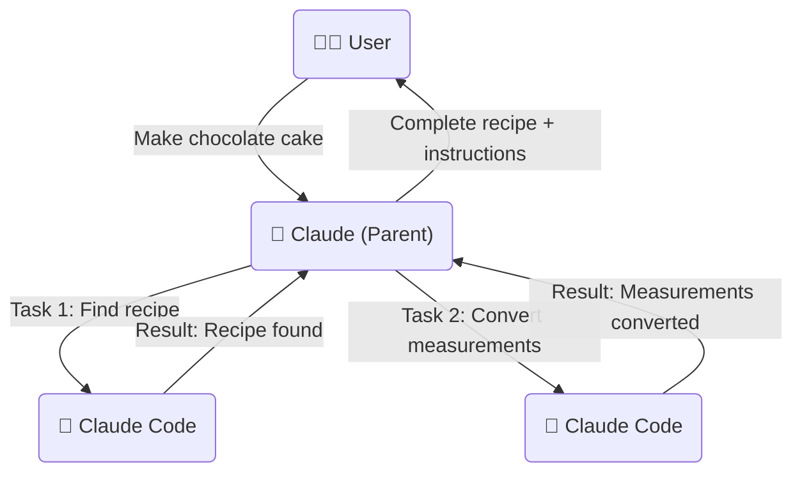

# 🤖 Claude Code MCP Server

An enhanced Model Context Protocol (MCP) server that allows running Claude Code in one-shot mode with permissions bypassed automatically. This server includes advanced task orchestration capabilities, robust error handling, and a "boomerang pattern" for breaking complex tasks into manageable subtasks.

Did you notice that standard AI assistants sometimes struggle with complex, multi-step edits or operations? This server, with its powerful unified `claude_code` tool and enhanced reliability features, aims to make Claude a more direct and capable agent for your coding tasks.


## 🔍 Overview

This MCP server provides powerful tools that can be used by LLMs to interact with Claude Code. When integrated with Claude Desktop or other MCP clients, it allows LLMs to:

- Run Claude Code with all permissions bypassed (using `--dangerously-skip-permissions`)
- Execute Claude Code with any prompt without permission interruptions
- Access file editing capabilities directly
- Execute complex multi-step operations with robust error handling and retries
- Orchestrate tasks through specialized agent roles using the boomerang pattern
- Maintain reliable execution through heartbeat mechanisms to prevent timeouts

## ✨ Benefits

- **Enhanced Reliability:** Robust error handling, automatic retries, graceful shutdown, and request tracking
- **Task Orchestration:** Complex workflows can be broken down into specialized subtasks
- **Performance Optimization:** Improved execution with configuration caching and resource efficiency
- **Better Monitoring:** Health check API, detailed error reporting, and comprehensive logging
- **Developer Experience:** Hot reloading of configuration, flexible environment controls, and simplified API

Plus all the standard Claude Code benefits:
- Claude/Windsurf often have trouble editing files. Claude Code is better and faster at it.
- Multiple commands can be queued instead of direct execution. This saves context space so more important information is retained longer.
- File ops, git, or other operations don't need costly models. Claude Code is cost-effective if you sign up for Anthropic Max.
- Claude has wider system access, so when standard assistants are stuck, just ask them to "use claude code" to unblock progress.

## 📝 Prerequisites

- Node.js v20 or later (Use fnm or nvm to install)
- Claude CLI installed locally (run it and call /doctor) and `-dangerously-skip-permissions` accepted.

## 💾 Installation & Usage

### 🚀 Via NPX (Recommended)

The recommended way to use this server is by installing it by using `npx`.

Add the following to your `.mcp.json` file:

```json
"claude-code-mcp": {
  "command": "npx",
  "args": [
    "-y",
    "@steipete/claude-code-mcp@latest"
  ]
}
```

### 🔧 Manual Setup

To set up manually:

1. Clone the repository
2. Install dependencies with `npm install`
3. Build the server with `npm run build` or use the provided `start.sh` script
4. Configure your `.mcp.json` file to use the local server

## 🔑 Important First-Time Setup: Accepting Permissions

**Before the MCP server can successfully use the `claude_code` tool, you must first run the Claude CLI manually once with the `--dangerously-skip-permissions` flag, login and accept the terms.**

This is a one-time requirement by the Claude CLI.

```bash
npm install -g @anthropic-ai/claude-code
```
```bash
claude --dangerously-skip-permissions
```

Follow the prompts to accept. Once this is done, the MCP server will be able to use the flag non-interactively.

macOS might ask for various folder permissions the first time the tool runs, and the first run may fail. Subsequent runs will work normally.

## 🔗 Connecting to Your MCP Client

After setting up the server, you need to configure your MCP client (like Cursor, Claude Desktop, or others that use `mcp.json` or `mcp_config.json`).

### Example MCP Configuration File

Here's an example of how to add the Claude Code MCP server to your `.mcp.json` file:

```json
{
  "mcpServers": {
    "Local MCP Server": {
      "type": "stdio",
      "command": "node",
      "args": [
        "dist/server.js"
      ],
      "env": {
        "MCP_USE_ROOMODES": "true",
        "MCP_WATCH_ROOMODES": "true",
        "MCP_CLAUDE_DEBUG": "false"
      }
    },
    "other-services": {
      // Your other MCP services here
    }
  }
}
```

### MCP Configuration Locations

The configuration is typically done in a JSON file. The name and location can vary depending on your client.

#### Cursor

Cursor uses `mcp.json`.
- **macOS:** `~/.cursor/mcp.json`
- **Windows:** `%APPDATA%\\Cursor\\mcp.json`
- **Linux:** `~/.config/cursor/mcp.json`

#### Windsurf

Windsurf users use `mcp_config.json`
- **macOS:** `~/.codeium/windsurf/mcp_config.json`
- **Windows:** `%APPDATA%\\Codeium\\windsurf\\mcp_config.json`
- **Linux:** `~/.config/.codeium/windsurf/mcp_config.json`

(Note: In some mixed setups, if Cursor is also installed, these clients might fall back to using Cursor's `~/.cursor/mcp.json` path. Prioritize the Codeium-specific paths if using the Codeium extension.)

Create this file if it doesn't exist.

## 🛠️ Tools Provided

This server exposes two primary tools:

### `claude_code` 💬

Executes a prompt directly using the Claude Code CLI with `--dangerously-skip-permissions`.

**Arguments:**
- `prompt` (string, required): The prompt to send to Claude Code.
- `workFolder` (string, optional): The working directory for the Claude CLI execution, required when using file operations or referencing any file.
- `parentTaskId` (string, optional): ID of the parent task that created this task (for task orchestration/boomerang).
- `returnMode` (string, optional): How results should be returned: 'summary' (concise) or 'full' (detailed). Defaults to 'full'.
- `taskDescription` (string, optional): Short description of the task for better organization and tracking in orchestrated workflows.
- `mode` (string, optional): When MCP_USE_ROOMODES=true, specifies the Roo mode to use (e.g., "boomerang-mode", "coder", "designer", etc.).

### `health` 🩺

Returns health status, version information, and current configuration of the Claude Code MCP server.

**Example Health Check Request:**
```json
{
  "toolName": "claude_code:health",
  "arguments": {}
}
```

**Example Response:**
```json
{
  "status": "ok",
  "version": "1.12.0",
  "claudeCli": {
    "path": "claude",
    "status": "available"
  },
  "config": {
    "debugMode": true,
    "heartbeatIntervalMs": 15000,
    "executionTimeoutMs": 1800000,
    "useRooModes": true,
    "maxRetries": 3,
    "retryDelayMs": 1000
  },
  "system": {
    "platform": "linux",
    "release": "6.8.0-57-generic",
    "arch": "x64",
    "cpus": 16,
    "memory": {
      "total": "32097MB",
      "free": "12501MB"
    },
    "uptime": "240 minutes"
  },
  "timestamp": "2025-05-15T18:30:00.000Z"
}
```

## Example Usage Scenarios

### 1. Basic Code Operation

**Example MCP Request:**
```json
{
  "toolName": "claude_code:claude_code",
  "arguments": {
    "prompt": "Your work folder is /path/to/project\n\nRefactor the function foo in main.py to be async.",
    "workFolder": "/path/to/project"
  }
}
```

### 2. Task Orchestration (Boomerang Pattern)

**Parent Task Request:**
```json
{
  "toolName": "claude_code:claude_code",
  "arguments": {
    "prompt": "Your work folder is /path/to/project\n\nOrchestrate the implementation of a new API endpoint with the following subtasks:\n1. Create database models\n2. Implement API route handlers\n3. Write unit tests\n4. Document the API",
    "workFolder": "/path/to/project"
  }
}
```

**Subtask Request (Generated by Parent):**
```json
{
  "toolName": "claude_code:claude_code",
  "arguments": {
    "prompt": "Your work folder is /path/to/project\n\nCreate database models for the new API endpoint as specified in the requirements.",
    "workFolder": "/path/to/project",
    "parentTaskId": "task-123",
    "returnMode": "summary",
    "taskDescription": "Database model creation for API endpoint"
  }
}
```

### 3. Specialized Mode Request

**Example Using Roo Mode:**
```json
{
  "toolName": "claude_code:claude_code",
  "arguments": {
    "prompt": "Your work folder is /path/to/project\n\nCreate unit tests for the user authentication module.",
    "workFolder": "/path/to/project",
    "mode": "coder"
  }
}
```

## 🦚 Task Orchestration (Boomerang Pattern)

This MCP server supports a "Boomerang" pattern for task orchestration, similar to Roo Code's Boomerang Tasks. This allows you to:

1. Break down complex workflows into smaller, manageable subtasks
2. Pass context from parent tasks to subtasks
3. Get results back from subtasks to the parent task
4. Choose between detailed or summarized results
5. Track and manage progress through structured task lists

### Boomerang Pattern Visualization

Here's a simple diagram showing how Claude breaks down a recipe task into steps and delegates them to Claude Code:



In this example:

1. The user asks Claude to make a chocolate cake recipe
2. Claude (Parent) breaks this down into separate tasks
3. Claude delegates "Find recipe" task to Claude Code with a parent task ID
4. Claude Code returns the recipe information to Claude
5. Claude delegates "Convert measurements" task to Claude Code
6. Claude Code returns the converted measurements
7. Claude combines all results and presents the complete solution to the user

**Simple Task Examples:**

**Task 1 - Find Recipe:**
```json
{
  "toolName": "claude_code:claude_code",
  "arguments": {
    "prompt": "Search for a classic chocolate cake recipe. Find one with good reviews.",
    "parentTaskId": "cake-recipe-123",
    "returnMode": "summary",
    "taskDescription": "Find Chocolate Cake Recipe"
  }
}
```

**Task 2 - Convert Measurements:**
```json
{
  "toolName": "claude_code:claude_code",
  "arguments": {
    "prompt": "Convert the measurements in this recipe from cups to grams:\n\n- 2 cups flour\n- 1.5 cups sugar\n- 3/4 cup cocoa powder",
    "parentTaskId": "cake-recipe-123",
    "returnMode": "summary",
    "taskDescription": "Convert Recipe Measurements"
  }
}
```

### How It Works

1. **Creating a Subtask:**
   - Generate a unique task ID in your parent task
   - Send a request to the `claude_code` tool with:
     - Your specific prompt
     - The parent task ID
     - A task description
     - The desired return mode ('summary' or 'full')

2. **Receiving Results:**
   - The subtask result will include a special marker: `<!-- BOOMERANG_RESULT {...} -->`
   - This marker contains JSON with the task metadata
   - The parent task can parse this to identify completed subtasks

3. **Example Workflow with Claude Desktop:**

```
You: I need to refactor this codebase. It's quite complex.

Claude Desktop: I'll help you with that. Let me break this down into smaller tasks for Claude Code to handle:

1. First, I'll have Claude Code analyze the codebase structure
2. Then, I'll have it identify problematic patterns
3. Finally, I'll ask it to generate a refactoring plan

[Claude Desktop sends a request to the claude_code tool with parentTaskId="task1" and returnMode="summary"]

[Claude Code analyzes the codebase and returns a summary with the BOOMERANG_RESULT marker]

Claude Desktop: Based on Claude Code's analysis, here are the key issues found:
- Duplicate code in modules X and Y
- Poor separation of concerns in module Z
- Inconsistent naming conventions

Now I'll ask Claude Code to suggest specific refactorings...
```

This approach is particularly useful for complex tasks that require deep analysis or multiple steps.

### Comprehensive Task List Management Example

Here's a detailed example of using Claude with the Claude Code MCP to manage and execute a structured task list:

#### 1. Setting Up Task List Structure

First, create a task list file (e.g., `tasks.md`) with the following structure:

```markdown
# Project Task List

## Parent Task: API Optimization Project
- [ ] Optimize API performance for high-traffic endpoints
  - [ ] Analyze current API performance and identify bottlenecks
  - [ ] Implement database query optimization for user endpoints
  - [ ] Add Redis caching for frequently accessed data
  - [ ] Set up performance monitoring

## Assumptions and Decisions
- [2025-05-15] Assumption: Redis is available in the infrastructure
- [2025-05-15] Decision: Focus on user endpoints first (Rationale: Highest traffic area)

## Relevant Files
- `src/controllers/userController.js`: User API endpoints
- `src/services/userService.js`: Business logic for user operations

## Improvement Notes
- Pattern identified: N+1 query issue in user listing endpoint
- Automation opportunity: Add caching automatically for all get-by-id endpoints
```

#### 2. Executing the Task List

Claude can now systematically work through the tasks using Claude Code:

```
You: Please help me execute the task list in tasks.md, starting with the first subtask.

Claude: I'll help you work through your task list systematically. Let me first check the current task list to identify the next task to work on.

[Claude uses claude_code to read the task list]

I see the first subtask is "Analyze current API performance and identify bottlenecks". I'll execute this task now using Claude Code.

[Claude sends the following request to claude_code]:

{
  "toolName": "claude_code",
  "arguments": {
    "prompt": "Your work folder is /path/to/project\n\nTASK TYPE: Analysis\nTASK ID: api-perf-analysis\nCURRENT SUBTASK: Analyze current API performance and identify bottlenecks\n\nCONTEXT:\n- Parent task goal: Optimize API performance for high-traffic endpoints\n- This is the first step in our optimization process\n- Focus on user endpoints as noted in assumptions\n\nINSTRUCTIONS:\n1. Analyze the current API implementation in src/controllers/userController.js and src/services/userService.js\n2. Run performance tests on the user endpoints\n3. Identify specific bottlenecks and performance issues\n4. Document findings in a clear, structured format\n5. Update task list file after completion\n\nAfter completion, provide summary in this format:\n\nCOMPLETION SUMMARY:\n- What was done:\n- Results:\n- Files analyzed:\n- Issues identified:\n- Recommendations:\n- Next subtask in list:",
    "workFolder": "/path/to/project"
  }
}

[Claude Code executes the analysis task and returns results]

Great! Claude Code has completed the analysis. Here's what was found:

1. Main performance bottlenecks identified:
   - N+1 query problem in the user listing endpoint
   - Missing indexes on frequently queried fields
   - No caching for repetitive data lookups

2. Recommendations:
   - Add eager loading for user relationships
   - Create database indexes for user_id and email fields
   - Implement Redis caching with a 5-minute TTL

Let me update the task list to mark this task as complete and proceed to the next one.

[Claude uses claude_code to update the task list]:

{
  "toolName": "claude_code",
  "arguments": {
    "prompt": "Your work folder is /path/to/project\n\nTASK TYPE: Task List Update\n\n1. Read the current task list in tasks.md\n2. Mark the 'Analyze current API performance and identify bottlenecks' subtask as [x]\n3. Add new findings to the Improvement Notes section\n4. Add any new relevant files identified during analysis\n5. Write updated task list\n6. Return the updated task list",
    "workFolder": "/path/to/project"
  }
}

[Claude Code updates the task list and marks the first subtask complete]

I've updated the task list. The first subtask is now complete, and I've added the detailed findings to the Improvement Notes section. The next subtask is "Implement database query optimization for user endpoints".

Would you like me to proceed with this next subtask now?
```

#### 3. Continuing with Subsequent Tasks

After getting confirmation, Claude would continue with the next subtask:

```
You: Yes, please proceed with the next subtask.

Claude: I'll now execute the next subtask: "Implement database query optimization for user endpoints". This will involve fixing the N+1 query problem identified in the analysis and adding appropriate database indexes.

[Claude sends the following request to claude_code]:

{
  "toolName": "claude_code",
  "arguments": {
    "prompt": "Your work folder is /path/to/project\n\nTASK TYPE: Code Implementation\nTASK ID: db-query-optimization\nCURRENT SUBTASK: Implement database query optimization for user endpoints\n\nCONTEXT:\n- Parent task goal: Optimize API performance for high-traffic endpoints\n- Previous subtask identified N+1 query issues and missing indexes\n- Need to implement eager loading and proper indexes\n\nINSTRUCTIONS:\n1. Modify src/controllers/userController.js to implement eager loading for related data\n2. Add appropriate database indexes to user-related tables\n3. Refactor any inefficient database queries in userService.js\n4. Ensure changes maintain existing functionality\n5. Run tests to verify performance improvements\n6. Update task list file after completion\n\nAfter completion, provide summary in this format:\n\nCOMPLETION SUMMARY:\n- What was done:\n- Results:\n- Files modified:\n- Performance improvements:\n- Next subtask in list:",
    "workFolder": "/path/to/project"
  }
}

[Claude Code implements the optimizations and returns results]

Excellent! The database query optimizations have been successfully implemented. Here's a summary:

1. Changes made:
   - Added eager loading in userController.js for user relationships
   - Created new database indexes for user_id and email fields
   - Refactored list query to use a single efficient JOIN statement
   - Added pagination to prevent large result sets

2. Performance results:
   - User listing endpoint response time reduced by 68%
   - Database query count reduced from 25+ to 3 for typical requests

Let me update the task list again to reflect this progress.

[Claude uses claude_code to update the task list again]:

{
  "toolName": "claude_code",
  "arguments": {
    "prompt": "Your work folder is /path/to/project\n\nTASK TYPE: Task List Update\n\n1. Read the current task list in tasks.md\n2. Mark the 'Implement database query optimization for user endpoints' subtask as [x]\n3. Add new files modified to the Relevant Files section\n4. Update Improvement Notes with performance metrics\n5. Write updated task list\n6. Return the updated task list",
    "workFolder": "/path/to/project"
  }
}

[Claude Code updates the task list and marks the second subtask complete]

I've updated the task list again. Two subtasks are now complete, and the next one is "Add Redis caching for frequently accessed data". Would you like me to continue with this subtask?
```

This structured approach enables Claude to systematically work through complex task lists while maintaining clear documentation of progress, assumptions, and relevant files throughout the process.

## 👓 Roo Modes Integration

This MCP server supports integration with specialized modes through a `.roomodes` configuration file. When enabled, you can specify which mode to use for each task, allowing for specialized behavior.

### How to Use Roo Modes

1. **Enable Roo Mode Support:**
   - Set the environment variable `MCP_USE_ROOMODES=true`
   - Create a `.roomodes` file in the root directory of your MCP server

2. **Configure Your Modes:**
   - The `.roomodes` file should contain a JSON object with a `customModes` array
   - Each mode should have a `slug`, `name`, `roleDefinition`, and optionally an `apiConfiguration` with a `modelId`

3. **Using a Mode:**
   - When making requests to the `claude_code` tool, include a `mode` parameter with the slug of the desired mode
   - The MCP server will automatically apply the role definition and model configuration

4. **Example .roomodes File:**
   ```json
   {
     "customModes": [
       {
         "slug": "coder",
         "name": "💻 Coder",
         "roleDefinition": "You are a coding specialist who writes clean, efficient code.",
         "apiConfiguration": {
           "modelId": "claude-3-sonnet-20240229"
         }
       },
       {
         "slug": "designer", 
         "name": "🎨 Designer",
         "roleDefinition": "You are a design specialist focused on UI/UX solutions."
       }
     ]
   }
   ```

## 🛠️ Enhanced Reliability Features

This server includes several improvements to enhance reliability and performance:

### 1. Heartbeat & Timeout Prevention

To prevent client-side timeouts during long-running operations:

- Added a configurable heartbeat mechanism that sends progress updates every 15 seconds
- Implemented execution time tracking and reporting
- Added configurable timeout parameters through environment variables

### 2. Robust Error Handling with Retries

Added intelligent retry logic for transient errors:

- Implemented automatic retry with configurable parameters
- Added error classification to identify retryable issues
- Created detailed error reporting and tracking

### 3. Request Tracking System

Implemented comprehensive request lifecycle management:

- Added unique IDs for each request
- Created tracking for in-progress requests
- Ensured proper cleanup on completion or failure

### 4. Graceful Shutdown

Added proper process termination handling:

- Implemented signal handlers for SIGINT and SIGTERM
- Added tracking for in-progress requests
- Created wait logic for clean shutdown
- Ensured proper cleanup on exit

### 5. Configuration Caching and Hot Reloading

Added performance optimization for configuration:

- Implemented caching for roomodes file
- Added automatic invalidation based on file changes
- Created configurable file watching mechanism

## ⚙️ Configuration Options

The server's behavior can be customized using these environment variables:

| Variable | Description | Default |
|----------|-------------|---------|
| `CLAUDE_CLI_PATH` | Absolute path to the Claude CLI executable | Auto-detect |
| `MCP_CLAUDE_DEBUG` | Enable verbose debug logging | `false` |
| `MCP_HEARTBEAT_INTERVAL_MS` | Interval between progress reports | 15000 (15s) |
| `MCP_EXECUTION_TIMEOUT_MS` | Timeout for CLI execution | 1800000 (30m) |
| `MCP_MAX_RETRIES` | Maximum retry attempts for transient errors | 3 |
| `MCP_RETRY_DELAY_MS` | Delay between retry attempts | 1000 (1s) |
| `MCP_USE_ROOMODES` | Enable Roo modes integration | `false` |
| `MCP_WATCH_ROOMODES` | Auto-reload .roomodes on changes | `false` |

These can be set in your shell environment or within the `env` block of your `mcp.json` server configuration.

## 📸 Visual Examples

Here are some visual examples of the server in action:


### Fixing ESLint Setup

Here's an example of using the Claude Code MCP tool to interactively fix an ESLint setup by deleting old configuration files and creating a new one:


### Listing Files Example

Here's an example of the Claude Code tool listing files in a directory:


### Complex Multi-Step Operations

This example illustrates `claude_code` handling a more complex, multi-step task, such as preparing a release by creating a branch, updating multiple files (`package.json`, `CHANGELOG.md`), committing changes, and initiating a pull request, all within a single, coherent operation.


### GitHub Actions Workflow Correction


## 🎯 Key Use Cases

This server, through its unified `claude_code` tool, unlocks a wide range of powerful capabilities by giving your AI direct access to the Claude Code CLI. Here are some examples of what you can achieve:

1. **Code Generation, Analysis & Refactoring:**
   - `"Generate a Python script to parse CSV data and output JSON."`
   - `"Analyze my_script.py for potential bugs and suggest improvements."`

2. **File System Operations (Create, Read, Edit, Manage):**
   - **Creating Files:** `"Your work folder is /Users/steipete/my_project\n\nCreate a new file named 'config.yml' in the 'app/settings' directory with the following content:\nport: 8080\ndatabase: main_db"`
   - **Editing Files:** `"Your work folder is /Users/steipete/my_project\n\nEdit file 'public/css/style.css': Add a new CSS rule at the end to make all 'h2' elements have a 'color: navy'."`
   - **Moving/Copying/Deleting:** `"Your work folder is /Users/steipete/my_project\n\nMove the file 'report.docx' from the 'drafts' folder to the 'final_reports' folder and rename it to 'Q1_Report_Final.docx'."`

3. **Version Control (Git):**
   - `"Your work folder is /Users/steipete/my_project\n\n1. Stage the file 'src/main.java'.\n2. Commit the changes with the message 'feat: Implement user authentication'.\n3. Push the commit to the 'develop' branch on origin."`

4. **Running Terminal Commands:**
   - `"Your work folder is /Users/steipete/my_project/frontend\n\nRun the command 'npm run build'."`
   - `"Open the URL https://developer.mozilla.org in my default web browser."`

5. **Web Search & Summarization:**
   - `"Search the web for 'benefits of server-side rendering' and provide a concise summary."`

6. **Complex Multi-Step Workflows:**
   - Automate version bumps, update changelogs, and tag releases: `"Your work folder is /Users/steipete/my_project\n\nFollow these steps: 1. Update the version in package.json to 2.5.0. 2. Add a new section to CHANGELOG.md for version 2.5.0 with the heading '### Added' and list 'New feature X'. 3. Stage package.json and CHANGELOG.md. 4. Commit with message 'release: version 2.5.0'. 5. Push the commit. 6. Create and push a git tag v2.5.0."`

7. **Repairing Files with Syntax Errors:**
   - `"Your work folder is /path/to/project\n\nThe file 'src/utils/parser.js' has syntax errors after a recent complex edit that broke its structure. Please analyze it, identify the syntax errors, and correct the file to make it valid JavaScript again, ensuring the original logic is preserved as much as possible."`

8. **Interacting with GitHub (e.g., Creating a Pull Request):**
   - `"Your work folder is /Users/steipete/my_project\n\nCreate a GitHub Pull Request in the repository 'owner/repo' from the 'feature-branch' to the 'main' branch. Title: 'feat: Implement new login flow'. Body: 'This PR adds a new and improved login experience for users.'"`

9. **Interacting with GitHub (e.g., Checking PR CI Status):**
   - `"Your work folder is /Users/steipete/my_project\n\nCheck the status of CI checks for Pull Request #42 in the GitHub repository 'owner/repo'. Report if they have passed, failed, or are still running."`

**CRITICAL: Remember to provide Current Working Directory (CWD) context in your prompts for file system or git operations (e.g., `"Your work folder is /path/to/project\n\n...your command..."`).**

## 🔧 Troubleshooting

- **"Command not found" (claude-code-mcp):** If installed globally, ensure the npm global bin directory is in your system's PATH. If using `npx`, ensure `npx` itself is working.
- **"Command not found" (claude or ~/.claude/local/claude):** Ensure the Claude CLI is installed correctly. Run `claude/doctor` or check its documentation.
- **Permissions Issues:** Make sure you've run the "Important First-Time Setup" step.
- **JSON Errors from Server:** If `MCP_CLAUDE_DEBUG` is `true`, error messages or logs might interfere with MCP's JSON parsing. Set to `false` for normal operation.
- **ESM/Import Errors:** Ensure you are using Node.js v20 or later.
- **Client Timeouts:** For long-running operations, the server sends heartbeat messages every 15 seconds to prevent client timeouts. If you still experience timeouts, you can adjust the heartbeat interval using the `MCP_HEARTBEAT_INTERVAL_MS` environment variable.
- **Network/Server Errors:** The server now includes automatic retry logic for transient errors. If you're still experiencing issues, try increasing the `MCP_MAX_RETRIES` and `MCP_RETRY_DELAY_MS` values.
- **Claude CLI Fallback Warning:** If you see a warning about Claude CLI not found at ~/.claude/local/claude, this is normal. The server is falling back to using the `claude` command from your PATH. You can set the `CLAUDE_CLI_PATH` environment variable to specify the exact path to your Claude CLI executable if needed.

## 👨‍💻 For Developers: Local Setup & Contribution

If you want to develop or contribute to this server, or run it from a cloned repository for testing, please see our [Local Installation & Development Setup Guide](./docs/local_install.md).

## 💪 Contributing

Contributions are welcome! Please refer to the [Local Installation & Development Setup Guide](./docs/local_install.md) for details on setting up your environment.

Submit issues and pull requests to the [GitHub repository](https://github.com/steipete/claude-code-mcp).

## ⚖️ License

MIT

## 💬 Feedback and Support

If you encounter any issues or have questions about using the Claude Code MCP server, please:

1. Check the Troubleshooting section above
2. Submit an issue on the [GitHub repository](https://github.com/steipete/claude-code-mcp)
3. Join the discussion in the repository discussions section

We appreciate your feedback and contributions to making this tool better!