```mermaid
%%{init: {
  'theme': 'neutral',
  'themeVariables': {
    'primaryColor': '#8be9fd',
    'primaryTextColor': '#282a36',
    'primaryBorderColor': '#6272a4',
    'lineColor': '#6272a4',
    'secondaryColor': '#bd93f9',
    'tertiaryColor': '#ffb86c'
  }
}}%%

flowchart TB
    classDef parent fill:#bd93f9,stroke:#6272a4,stroke-width:2px,color:#282a36
    classDef subtask fill:#8be9fd,stroke:#6272a4,stroke-width:2px,color:#282a36
    classDef result fill:#50fa7b,stroke:#6272a4,stroke-width:2px,color:#282a36
    classDef taskList fill:#ffb86c,stroke:#6272a4,stroke-width:2px,color:#282a36

    User(["🧑‍💻 User Request"])
    Claude["🤖 Claude (Parent Agent)"]
    TaskList["📋 Task List"]
    SubtaskA["🔍 Subtask A\n(Analysis)"]
    SubtaskB["⚙️ Subtask B\n(Implementation)"]
    SubtaskC["🧪 Subtask C\n(Testing)"]
    ResultA["📊 Result A"]
    ResultB["📊 Result B"]
    ResultC["📊 Result C"]
    FinalResult["✅ Final Result"]
    
    User -->|"Complex Request"| Claude
    Claude -->|"1. Creates"| TaskList
    Claude -->|"2. Delegates\nparentTaskId='task-123'\nreturnMode='summary'"| SubtaskA
    SubtaskA -->|"3. Executes"| ResultA
    ResultA -->|"4. Returns with\nBOOMERANG_RESULT\nmarker"| Claude
    Claude -->|"5. Updates"| TaskList
    
    Claude -->|"6. Delegates\nparentTaskId='task-123'\nreturnMode='summary'"| SubtaskB
    SubtaskB -->|"7. Executes"| ResultB
    ResultB -->|"8. Returns with\nBOOMERANG_RESULT\nmarker"| Claude
    Claude -->|"9. Updates"| TaskList
    
    Claude -->|"10. Delegates\nparentTaskId='task-123'\nreturnMode='summary'"| SubtaskC
    SubtaskC -->|"11. Executes"| ResultC
    ResultC -->|"12. Returns with\nBOOMERANG_RESULT\nmarker"| Claude
    Claude -->|"13. Updates"| TaskList
    
    Claude -->|"14. Compiles results"| FinalResult
    FinalResult -->|"15. Returns consolidated results"| User
    
    class Claude parent
    class TaskList taskList
    class SubtaskA,SubtaskB,SubtaskC subtask
    class ResultA,ResultB,ResultC,FinalResult result
```

The above Mermaid chart illustrates the Task Orchestration (Boomerang Pattern) workflow:

1. The user makes a complex request to Claude (Parent Agent)
2. Claude creates a structured task list to break down the work
3. Claude delegates Subtask A with a parent task ID and specified return mode
4. Subtask A executes its specific function (Analysis)
5. Results from Subtask A return to Claude with a BOOMERANG_RESULT marker
6. Claude updates the task list with the results and marks the subtask as complete
7. The process repeats for Subtask B (Implementation) and Subtask C (Testing)
8. Claude compiles all results into a final consolidated response
9. The complete solution is returned to the user

This pattern allows complex workflows to be broken down into specialized, manageable subtasks while maintaining context and tracking progress throughout the entire process.