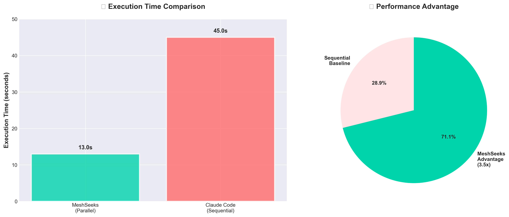
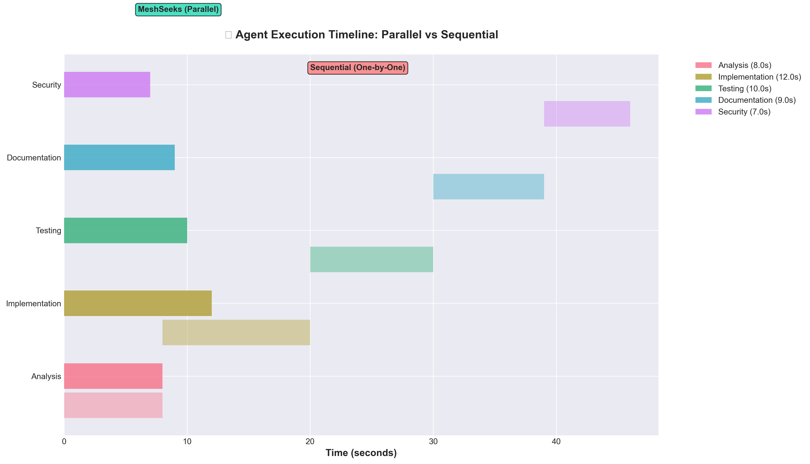
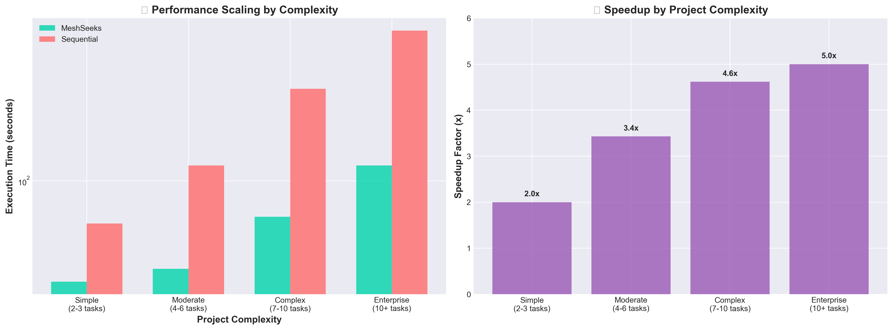
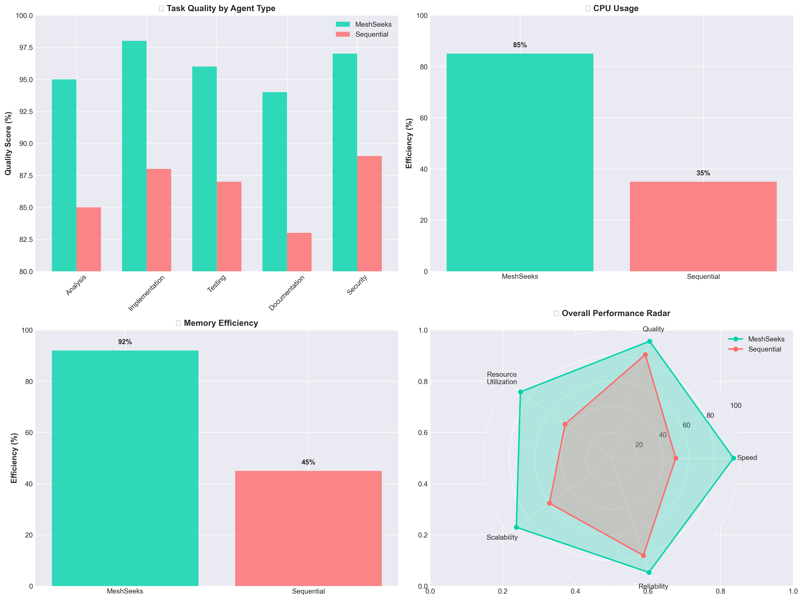
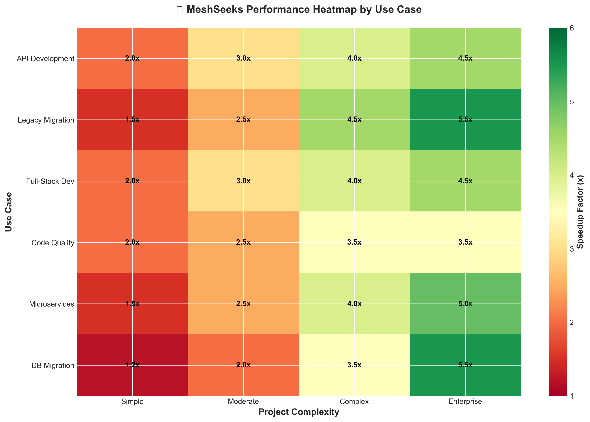
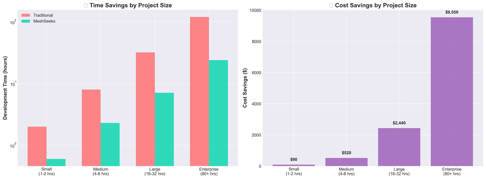

# 📊 MeshSeeks Performance Visualizations

## Generated Charts

### 1. Performance Comparison

- **Main execution time comparison**
- **Speedup visualization**

### 2. Agent Timeline

- **Parallel vs sequential execution timeline**
- **Agent specialization breakdown**

### 3. Scaling Analysis

- **Performance by project complexity**
- **Speedup scaling factors**

### 4. Efficiency Breakdown

- **Resource utilization metrics**
- **Quality scores by agent type**
- **Performance radar chart**

### 5. Use Case Heatmap

- **Performance matrix by use case and complexity**
- **Optimal scenario identification**

### 6. ROI Analysis

- **Time savings by project size**
- **Cost-benefit analysis**

---
*Generated automatically by MeshSeeks visualization suite*
