# 🎭 Using Claude Code as the Orchestrator

While Claude Desktop is often used as the parent agent, you can use Claude Code itself as both the orchestrator and executor. This approach creates a self-contained system where Claude Code manages its own task orchestration, without requiring Claude Desktop.

## 🔄 Self-Orchestration Flow

```mermaid
graph TB
    User("👨‍💻 User")
    ClaudeCode("🤖 Claude Code\nOrchestrator")
    ClaudeCodeSubtask1("⚙️ Claude Code\nSubtask 1")
    ClaudeCodeSubtask2("⚙️ Claude Code\nSubtask 2")
    
    User-->|"Complex project request"| ClaudeCode
    ClaudeCode-->|"1. Plans tasks"| ClaudeCode
    ClaudeCode-->|"2. Executes subtask 1"| ClaudeCodeSubtask1
    ClaudeCodeSubtask1-->|"3. Returns result"| ClaudeCode
    ClaudeCode-->|"4. Executes subtask 2"| ClaudeCodeSubtask2
    ClaudeCodeSubtask2-->|"5. Returns result"| ClaudeCode
    ClaudeCode-->|"6. Final solution"| User
```



## 🚀 Implementation Steps

### 1. Create an Entry Script

Create a shell script that will initiate the orchestration process:

```bash
#!/bin/bash

# orchestrate.sh
echo "Starting Claude Code orchestration process..."

# Initial task description (saved to a file)
cat > task.json << EOL
{
  "project": "Recipe Converter App",
  "description": "Create a simple web app that converts recipe measurements",
  "tasks": [
    {
      "id": "task-1",
      "description": "Create HTML structure",
      "status": "pending"
    },
    {
      "id": "task-2",
      "description": "Implement conversion logic",
      "status": "pending"
    },
    {
      "id": "task-3",
      "description": "Add styling",
      "status": "pending"
    }
  ]
}
EOL

# Launch the orchestrator
echo "Launching orchestrator..."
claude --dangerously-skip-permissions -p "You are an orchestrator tasked with breaking down and executing a project. Read the task.json file to understand the project requirements and execute each task in sequence. After completing each task, update task.json to mark it as completed before moving to the next task." > orchestrator_output.log

echo "Orchestration complete. See orchestrator_output.log for details."
```

### 2. The Orchestrator Prompt

When Claude Code starts as the orchestrator, it would:

1. Read the task.json file to understand the project
2. Process each task sequentially by creating and executing subtasks
3. Update the task.json file after each completion

Here's the flow of execution:

```
1. Claude Code reads task.json and sees three tasks
2. Claude Code takes task-1: "Create HTML structure"
3. Claude Code creates index.html with a form structure
4. Claude Code updates task.json, marking task-1 as "completed"
5. Claude Code takes task-2: "Implement conversion logic"
6. Claude Code creates script.js with measurement conversion functions
7. Claude Code updates task.json, marking task-2 as "completed"
8. Claude Code takes task-3: "Add styling"
9. Claude Code creates styles.css with responsive design
10. Claude Code updates task.json, marking task-3 as "completed"
11. Claude Code reports completion of all tasks with a summary
```

## 📋 Sample Task Data Structure

A more elaborate task.json structure that Claude Code would maintain:

```json
{
  "project": "Recipe Converter App",
  "description": "Create a simple web app that converts recipe measurements",
  "status": "in_progress",
  "tasks": [
    {
      "id": "task-1",
      "description": "Create HTML structure",
      "status": "completed",
      "completedAt": "2025-05-15T14:30:00Z",
      "outputs": [
        "index.html"
      ]
    },
    {
      "id": "task-2",
      "description": "Implement conversion logic",
      "status": "in_progress",
      "startedAt": "2025-05-15T14:35:00Z"
    },
    {
      "id": "task-3",
      "description": "Add styling",
      "status": "pending"
    }
  ],
  "logs": [
    {
      "timestamp": "2025-05-15T14:25:00Z",
      "message": "Project started"
    },
    {
      "timestamp": "2025-05-15T14:30:00Z",
      "message": "Task 1 completed: Created HTML with form for recipe inputs"
    }
  ]
}
```

## 📝 Task Processing Scripts

### Task Executor Script (task_executor.sh)

```bash
#!/bin/bash

# task_executor.sh
# Usage: ./task_executor.sh <task_id>

TASK_ID=$1

# Extract task details from task.json
TASK_DESC=$(jq -r ".tasks[] | select(.id == \"$TASK_ID\") | .description" task.json)

# Update task status to in_progress
jq ".tasks[] |= if .id == \"$TASK_ID\" then .status = \"in_progress\" | .startedAt = \"$(date -u +\"%Y-%m-%dT%H:%M:%SZ\")\" else . end" task.json > task.json.tmp && mv task.json.tmp task.json

# Execute the task using Claude Code
claude --dangerously-skip-permissions -p "Execute the following task: $TASK_DESC. Project context: $(jq -c . task.json). Create necessary files and when complete, list all created or modified files. Title the list 'FILES_MODIFIED:' followed by one filename per line." > "execution_$TASK_ID.log"

# Extract created files from log
FILES_MODIFIED=$(grep -A 100 "FILES_MODIFIED:" "execution_$TASK_ID.log" | tail -n +2)

# Update task.json with completion
jq ".tasks[] |= if .id == \"$TASK_ID\" then .status = \"completed\" | .completedAt = \"$(date -u +\"%Y-%m-%dT%H:%M:%SZ\")\" | .outputs = [$FILES_MODIFIED | split("\n") | .[] | select(length > 0) | @json] else . end" task.json > task.json.tmp && mv task.json.tmp task.json

# Add to logs
jq ".logs += [{\"timestamp\": \"$(date -u +\"%Y-%m-%dT%H:%M:%SZ\")\", \"message\": \"Task $TASK_ID completed: $TASK_DESC\"}]" task.json > task.json.tmp && mv task.json.tmp task.json

echo "Task $TASK_ID ($TASK_DESC) completed"
```

## 🛠️ Advanced: Adding Error Handling and Retries

For more robust orchestration, include error handling and retry mechanisms:

```bash
#!/bin/bash

# execute_with_retry.sh
# Usage: ./execute_with_retry.sh <task_id> <max_retries>

TASK_ID=$1
MAX_RETRIES=${2:-3}  # Default to 3 retries

for ((i=1; i<=MAX_RETRIES; i++)); do
  echo "Attempt $i of $MAX_RETRIES for task $TASK_ID"
  
  # Execute task
  ./task_executor.sh "$TASK_ID"
  
  # Check if task is marked as completed in task.json
  STATUS=$(jq -r ".tasks[] | select(.id == \"$TASK_ID\") | .status" task.json)
  
  if [ "$STATUS" == "completed" ]; then
    echo "Task $TASK_ID completed successfully"
    exit 0
  else
    echo "Task $TASK_ID failed, retrying..."
    # Add to logs
    jq ".logs += [{\"timestamp\": \"$(date -u +\"%Y-%m-%dT%H:%M:%SZ\")\", \"message\": \"Task $TASK_ID failed on attempt $i, retrying\"}]" task.json > task.json.tmp && mv task.json.tmp task.json
    # Reset task status
    jq ".tasks[] |= if .id == \"$TASK_ID\" then .status = \"pending\" else . end" task.json > task.json.tmp && mv task.json.tmp task.json
    sleep 2  # Brief pause before retry
  fi
done

echo "Task $TASK_ID failed after $MAX_RETRIES attempts"
jq ".tasks[] |= if .id == \"$TASK_ID\" then .status = \"failed\" else . end" task.json > task.json.tmp && mv task.json.tmp task.json
exit 1
```

## 💡 Key Benefits of Self-Orchestration

1. **Self-contained**: No external orchestrator (like Claude Desktop) required
2. **Persistent state**: All task information is stored in JSON files
3. **Error recovery**: Can resume from the last successful task if interrupted
4. **Simplified dependency management**: Single system manages all Claude Code interactions
5. **Shell script automation**: Easily integrated into CI/CD pipelines or automated workflows

## 🧩 Task Dependencies

For more complex projects with task dependencies, the task.json can be enhanced:

```json
{
  "tasks": [
    {
      "id": "task-1",
      "description": "Create database schema",
      "status": "completed"
    },
    {
      "id": "task-2",
      "description": "Generate API endpoints",
      "dependencies": ["task-1"],
      "status": "pending"
    },
    {
      "id": "task-3",
      "description": "Create frontend components",
      "status": "pending"
    },
    {
      "id": "task-4",
      "description": "Connect frontend to API",
      "dependencies": ["task-2", "task-3"],
      "status": "pending"
    }
  ]
}
```

The orchestrator would check dependencies before starting any task, ensuring they are all completed first.

## 🔄 Putting It All Together

This self-orchestration flow enables Claude Code to manage complex projects autonomously, breaking them down into manageable subtasks and executing them in the correct order while maintaining state throughout the process.
